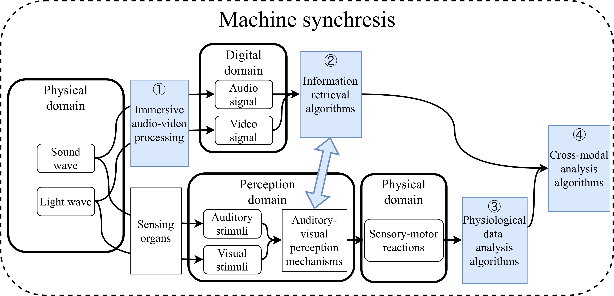

# What is machine synchresis?

It's an attempt to combine Pierre Schaeffer and Michel Chion's musicology theory, *Sound objects* and *Synchresis*, with Music Information Retrieval technologies such as transformer neural networks and spatial audio processing. Apart from these two concepts, *Embodied Cognition* and *Immersive technologies* also play an important in machine synchresis.

# The signal flow

# Links

## Datasets

#### SoundActions

[[Download on OSF]](https://osf.io/3z65b/overview)    [[Preview on YouTube]](https://www.youtube.com/watch?v=GjhufgptatQ&list=PLhzu1xESru9RDkxVUmiz19JMIgtbJ5-xu)

#### Stillstanding365

[[Download on OSF]](https://osf.io/3z65b/overview)

## Toolboxes

#### Ambiviz

Visualization tools for ambisonic audio (and 360 video).

[[GitHub]](https://github.com/fisheggg/ambiviz) [[PyPI]](https://pypi.org/project/ambiviz/)

#### MGT-Python

[GitHub](https://github.com/fourMs/MGT-python)

## Papers

#### Paper 1
Comparing Four 360-Degree Cameras for Spatial Video Recording and Analysis

[[PDF]](https://smcnetwork.org/smc2024/papers/SMC2024_paper_id122.pdf)

#### Paper 2
Comparing Spatial Audio Recordings from Commercially Available 360-Degree Video Cameras

[[PDF]](https://link.springer.com/chapter/10.1007/978-3-031-97254-6_12)

#### Paper 3
Investigating Auditory-Visual Perception using Multimodal Neural Networks with the SoundActions Dataset

[[TISMIR site]](https://transactions.ismir.net/articles/10.5334/tismir.223)

#### Paper 4
Cross-Modal Analysis of Spatial-Temporal Auditory Stimuli and Human Micromotion when Standing Still in Indoor Environments

[[PDF]](https://zenodo.org/records/17502603)

#### Paper 5
Ambient-rPPG: Investigating the effect of indoor environments on heart rate with immersive multi-modal neural network

[Under review]
